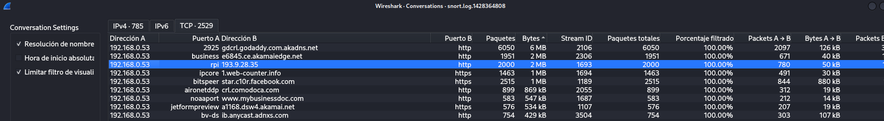
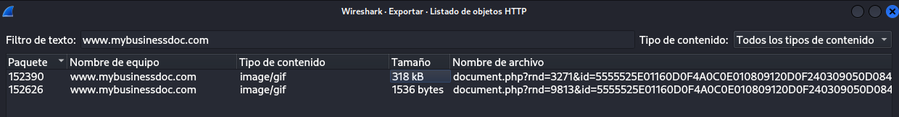
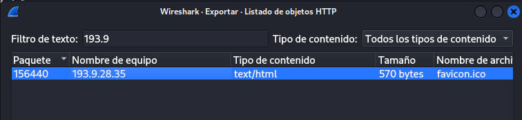
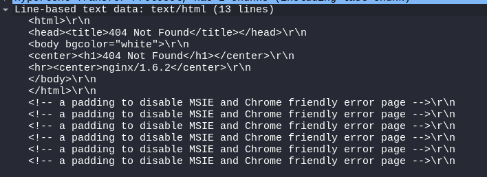
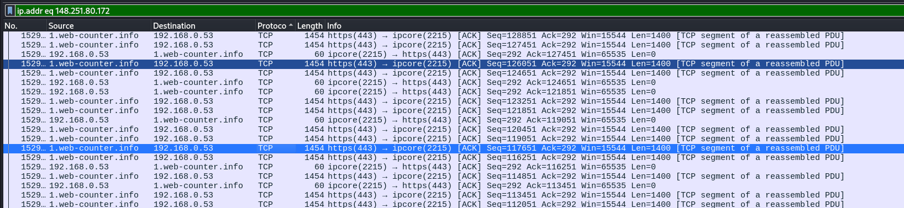
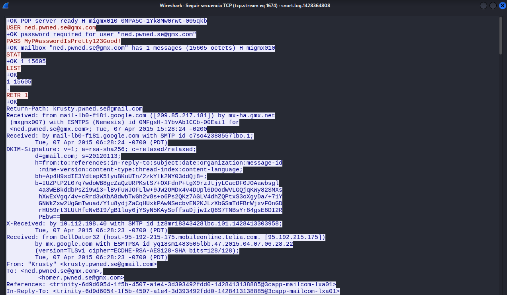

# Pregunta 2

## Ejercicio 2.1

## ¿De cuáles tres dominios "extraños" (no legítimos) se realizaron las descargas más grandes desde el ordenador de Ned (192.168.0.53)?

## Descarte las descargas de dominios comunes como Microsoft, Google, Facebook, Akamai y otros dominios legítimos.

Lo priemro que he hecho para encontrar los tres dominio extraños que realizaron las descargas más grandes es:

1. Aplicar el filtro para buscar descargas de esta RED por el puerto 80 443

```bash
ip.addr == 192.168.0.53 && (tcp.port == 80 || tcp.port == 443)
```

2. Después me he ido a Estadísticas -> Conversaciones, hay filtro por tamaño de bu¡ytes y ponemos la opcion de resolver nombre:



3. Podemos ver que las dos primeras tiene que ver con el servicio de AKAMAI asi que esa no son extrañas la extrañas son:

- 193.9.28.35 

- 1.web_counter.info 148.251.80.172

- www.mybusinessdoc.com 68.164.182.11

## Ejercicio 2.2

## ¿Son maliciosos los archivos descargados desde www.mybusinessdoc.com (68.164.182.11)?

1. Aplico el filtro de la IP

```bash
ip.addr == 68.164.182.11
```
2. Después me he ido a Archivo > Exportar Objetos > HTTP

3. Filtramos por el nombre de la página ***www.mybusinessdoc.com***



Estos son los archivos que he encontrado.

## Ejercicio 2.3

## ¿La página HTML descargada desde 193.9.28.35 parece legítima?

1. Aplicamos el filtro por la IP 193.9.28.35 

```bash
ip.addr == 193.9.28.35
```
2. Después me he ido a Archivo > Exportar Objetos > HTTP

3. Filtramos por la IP y encontramos esto:



4. Vemos el HTML y no parece legitimo:



## Ejercicio 2.4

## ¿La descarga desde 1.web-counter.info (148.251.80.172) usó HTTP, SSL u otro protocolo?

1. Aplicamos el filtro recomendado

```bash
ip.addr eq 148.251.80.172
```



Utiliza TCP como protocolo para descacrgar

## Ejercicio 2.5

## ¿Cómo fue entregado este malware al ordenador de Ned? (¿A través de HTTP / Correo electrónico / Chat / Otro?)

1. Busco con el Buscar y la opción de Packet bytes el archivo "Delivery_Notification_00000529832.zip"

2. Después seleccionamos el paquete en el que se encuentra el .zip -> CLic derecho -> Seguir -> TCP Stream

3.  Podemos ver que lo ha enviado por email:



Fue por correo 

